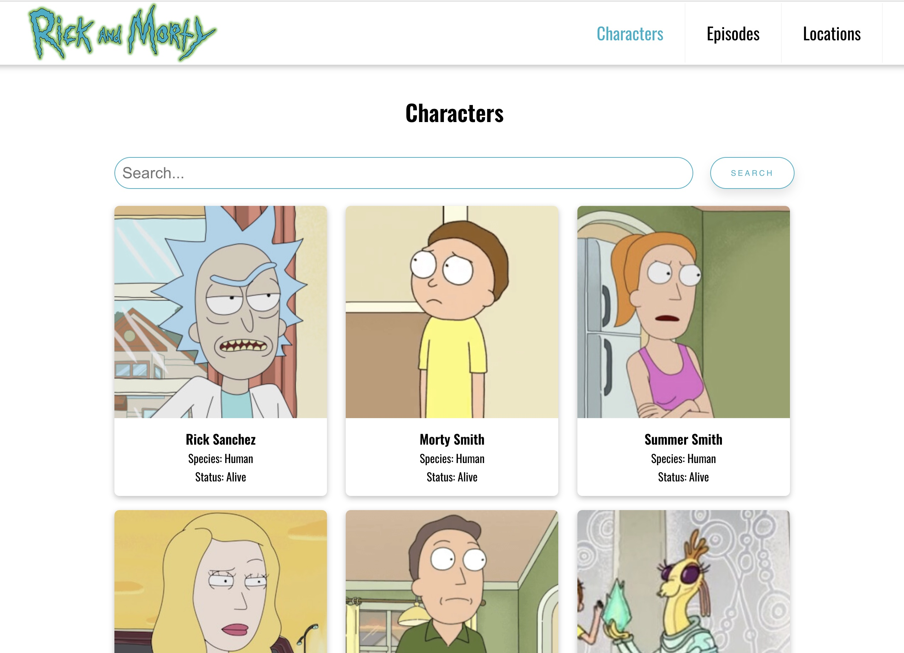
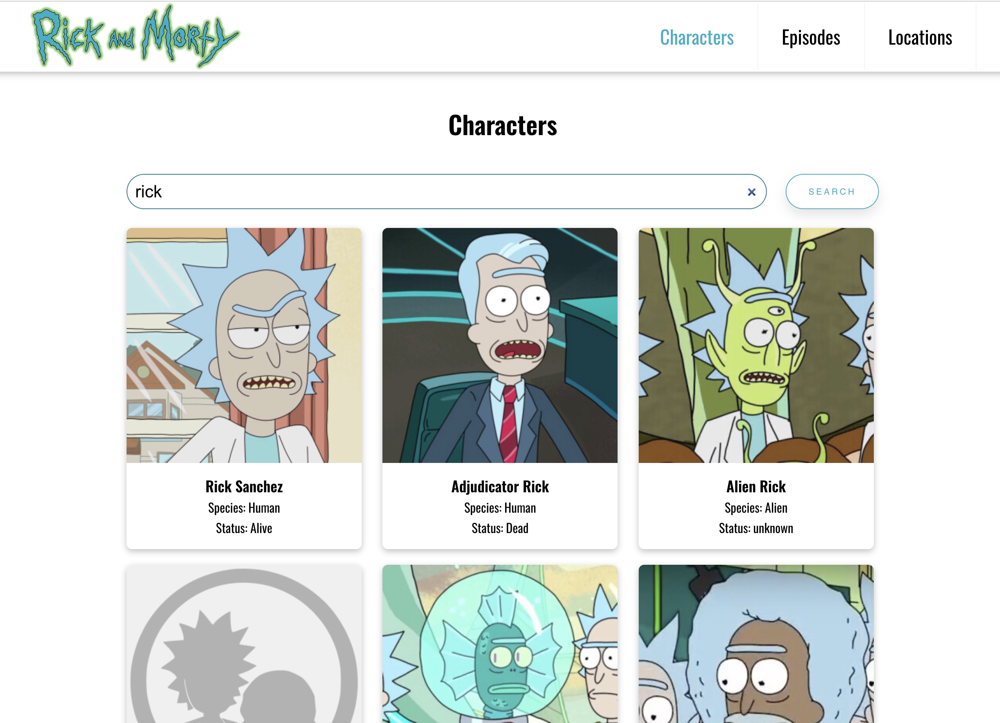
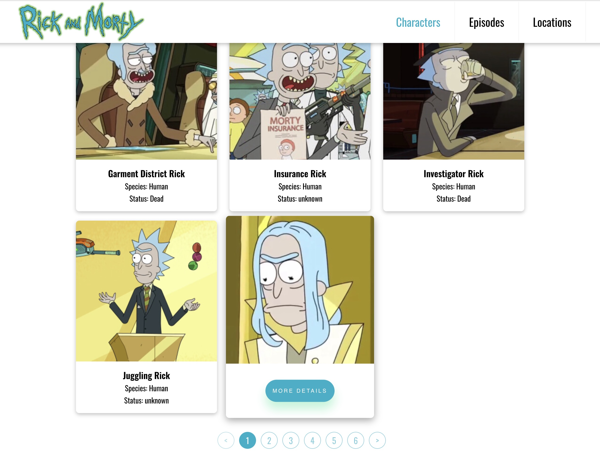
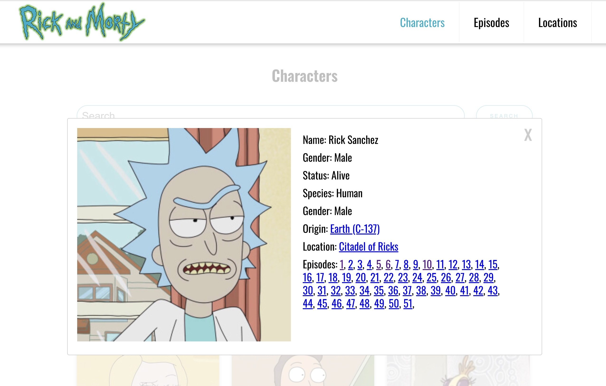

# Rick and Morty Character Viewer

## Overview

This web application allows users to browse and view characters from the Rick and Morty series.

## Running Locally

To run the application locally:

1. Clone the repository: `git clone git@github.com:Maksym-Mytiuk/rick-and-morty-character-viewer.git`
2. Navigate to the project directory: `cd rick-and-morty-character-viewer`
3. Install dependencies: `npm install`
4. Start the development server: `npm start`
5. Open a browser and navigate to `http://localhost:5173/`

## How to Use

1. **Browsing Characters**: Navigate to the main page to view a list of characters. You can scroll through them or use the pagination controls to jump between pages.
2. **Viewing Character Details**: Click on a character to view more detailed information about them.
3. **Searching for Characters**: Use the search bar at the top to search for characters by name or other attributes. The displayed list will update based on your search input.

## Live Demo

https://maksym-mytiuk.github.io/

## Screenshots

## Authors

Maksym Mytiuk [github](https://github.com/Maksym-Mytiuk), [linkedin](https://www.linkedin.com/in/maksym-mytiuk/)
